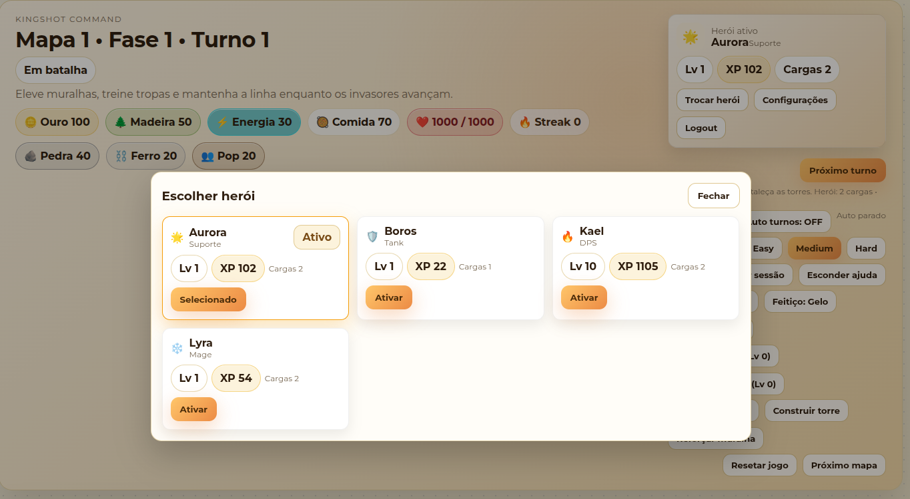
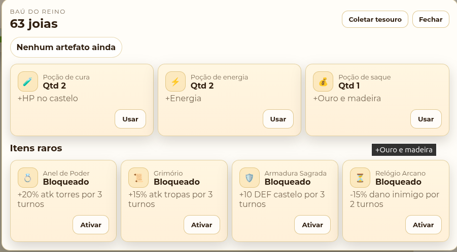
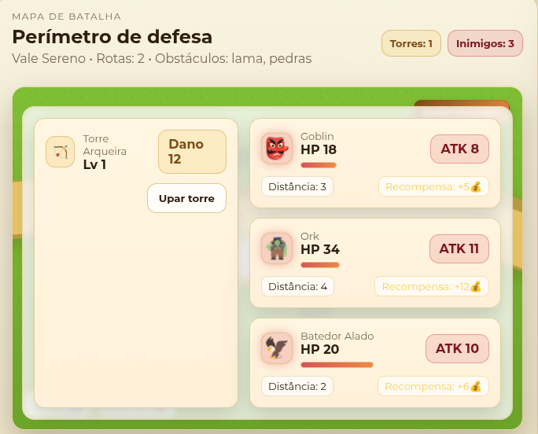

🎮 README.md do projeto — Arcade Game / Kingshot Terminal

<div align="center">
  
# 🏰 Kingshot Terminal  
### A Tower Defense Experience • Node.js API + React Front

Um mini–jogo estilo **tower defense** totalmente construído em **JavaScript**, agora com **TypeScript em migração gradual**, usando:

🚀 **Backend**: Node.js + Express (com TypeScript em migração gradual)  
🎨 **Frontend**: React + CSS customizado (migrando para `.tsx`)  
🧠 **Game Engine própria**: lógica de turnos, fases, torres, tropas e inimigos  
📝 **TypeScript**: tipagem progressiva no back e front para mais segurança e clareza


</div>

---

## 📌 Sobre o jogo

**Kingshot Terminal** é um jogo inspirado em Kingshot / Clash Mini / Tower Defense, mas com uma proposta diferente:

🛡 Você administra um **castelo**,  
🏹 evolui torres,  
⚔️ treina tropas,  
👹 enfrenta ondas de inimigos,  
📈 avança fases  
… tudo em **turnos**, consumindo uma API real.

É como jogar um jogo mobile, mas com lógica totalmente transparente e API aberta.

---

## 🧱 Estrutura do Projeto

```
arcade-game/
│
├── docker-compose.yml  # Orquestra API, Front e Postgres
├── api/                 # Backend Node (Express + Game Engine, TS-ready)
│   ├── src/
│   │   ├── controllers/
│   │   ├── data/
│   │   ├── middleware/
│   │   ├── routes/      # agora .ts
│   │   ├── services/    # GameEngine.ts, saveStore.ts
│   │   ├── types/       # GameState, Hero, ApiResponse
│   │   └── server.js    # usa ts-node/register
│   ├── Dockerfile
│
└── app/                 # Frontend React estilizado como jogo mobile (TS em progresso)
    ├── public/
    ├── Dockerfile
    └── src/
        ├── api/         # agora em .ts com jsonFetch resiliente
        ├── assets/
        ├── components/  # renomeados para .tsx (com @ts-nocheck temporário)
        ├── hooks/       # useGame.ts tipado
        ├── pages/       # agora em .tsx
        ├── types/       # GameState, Hero, ApiResponse compartilhados
        ├── App.tsx      # será migrado em breve
        ├── App.css
        └── index.js
```

---

## ⚙️ Como Rodar o Projeto

### 1) Rodando o backend (Node.js)

```bash
cd api
npm install
npm start
# tipagem: npm run typecheck   # valida TS sem emitir
```

A API sobe em:

```
http://localhost:8000/game
```

### 2) Rodando o frontend (React)

Em outro terminal:

```bash
cd app
npm install
npm start
# tipagem: npm run typecheck   # valida TS sem emitir
```

O jogo abre automaticamente em:

```
http://localhost:3000
```

### 3) Rodando tudo com Docker

1. Crie `api/.env` com as credenciais para o Postgres do compose:
   ```
   DATABASE_URL=postgres://kingshot:kingshot123123@db:5432/kingshot
   JWT_SECRET=dev-secret-change-me
   ```
2. Suba tudo:
   ```bash
   docker-compose up --build
   ```
3. Serviços:
   - API: http://localhost:8000
   - Front: http://localhost:3000
   - Postgres: localhost:5432 (user: kingshot / pass: kingshot123123 / db: kingshot)

### 4) Instalando o banco de dados (Postgres)

Use o Docker para rodar um container Postgres localmente:

```bash
docker run --name arcade-postgres -e POSTGRES_PASSWORD=yourpassword -p 5432:5432 -d postgres
```

```
Altere `yourpassword` para a senha desejada.
Crie o banco `arcade_game` e configure a conexão no arquivo `.env` do backend.
```


---

## 🎯 Funcionalidades Principais
### 🆕 Novidades recentes
- **Migração para TypeScript**: backend (GameEngine, saveStore, db, rotas) e frontend (API client, hooks, componentes/páginas) em `.ts/.tsx`, com tipos compartilhados (GameState, Hero, ApiResponse) em `api/src/types` e `app/src/types`.
- **Scripts de typecheck**: `npm run typecheck` no `api/` e no `app/` para validar tipagem sem build.
- **Camada de fetch resiliente**: `jsonFetch` em todas as chamadas do front evita crash quando a API estiver offline e retorna mensagem amigável.
- **Compatibilidade incremental**: componentes de UI seguem com `@ts-nocheck` temporário enquanto tipagem é concluída.
- **Novos heróis com skills**: Guardião Real (escudo/muralha), Arqueira Élfica (chuva de flechas/crit), Alquimista Arcano (buffs de recursos), Mestre das Feras (fera sempre pronta e dano físico).
- **Biomas e layouts**: mapas possuem efeitos (lentidão inimiga, buff de torre, obstáculos) e influenciam o fluxo da onda.
- **Itens raros & fera**: progressão desbloqueia anel, grimório, armadura, relógio e invocação de fera gigante por mapa.
- **Persistência por usuário**: saves individuais em Postgres + JWT; reset e próximo mapa preservam inventário e progressos-chave.

### 🏰 Castelo
- Vida, defesa e cura com energia + comida (buffada por curandeiros/eventos)
- Muralha com níveis e pesquisas de pedra/ferro
- Defesa extra de escudos na fase de combate e runas de guarda
- Ganha dano por turno se inimigos sobreviverem

### 🧩 UI / HUD / Qualidade de Vida
- Log fixo na lateral com agrupamento de eventos
- HUD de status (turno, fase, mapa, streak, buffs/debuffs, evento) + timeline de ação
- Conselheiro IA com dicas contextuais e toggle ON/OFF
- Modal de tesouros/poções/itens raros com barras de duração; baú com joias
- Mapas trocam visual por bioma; obstáculos/buffs/debuffs exibidos
- Modal de troca de herói com níveis, XP e cargas por herói

### 🏹 Torres
- Construção de novas torres
- Upgrades de nível
- Runas por torre (poder/guarda) e buffs de pesquisa

### ⚔️ Tropas
- Tipos: soldiers e archers
- Ataque coletivo por turno com speed/crit/armor/pen
- Treinamento por recurso
- Evolução de tropas (aumenta ATK / HP / speed)

### 🪖 Construtores
- Construtores coletam madeira, ouro e comida por ação dedicada
- Possível contratar mais construtores (custo em recursos)

### 🏛 Quartel & Arsenal
- Fabricação e melhoria de: catapultas, canhões antigos, cavalos, cavalaria, escudos e lanças
- Armas de cerco e cavalaria adicionam dano extra; escudos somam defesa do castelo
- Runas aplicam buffs nas torres; pesquisas de cerco e engenharia aumentam dano
- Armory também inclui cannons, catapults e progressão por nível

### 👹 Inimigos
- HP, max HP (com barra), ícone, ataque, distância e recompensa em ouro
- Roles: tanque, voador, suporte; chefes batem 2x e têm escudo
- Orks e chefes concedem energia e cura ao morrer
- Novos inimigos/mutações por mapa, mini-eventos por turno

### 🔁 Sistema de turnos
Mecânica a cada turno:
1. Torres atacam  
2. Tropas + arsenal atacam (ordem por speed)  
3. Inimigos revidam (considerando escudos)  
4. Castelo recebe dano residual (boss ataca 2x, voadores podem agir antes)  
5. Recompensas por inimigos mortos  
6. Eventos/buffs/debuffs aplicados  
7. Avança turno / fase

### 🪵 Recursos
- Ouro, madeira, comida, energia, pedra, ferro, população
- Coleta padrão e coleta de construtores (com retorno decrescente)
- Custos dinâmicos por fase/mapa e mapa com efeitos (ralentamento/buff)
- Tiles de construtor com riqueza variada para otimizar alocação
- Loot buff/achievements para recompensas extras

### 🎒 Tesouros & Poções
- Baú com joias, artefatos (placeholder), poções (cura, energia, saque) e itens raros
- Itens raros: Anel de Poder, Grimório, Armadura Sagrada, Relógio Arcano (efeitos temporários)
- Fera gigante invocável 1x por mapa (unlock por progressão)
- Modal para abrir baú, consumir itens e ver duração

### 🔄 Reset / Mapa
- Reset do jogo a qualquer momento
- Game Over quando HP chega a 0
- Vitória do mapa ao vencer todas as fases, com opção de próximo mapa

### 🖼 Preview






---

## 📡 Rotas da API

- `POST /game/start` — Inicia um novo jogo.
- `GET /game/status` — Retorna o estado atual.
- `POST /game/turn` — Resolve o turno e retorna o novo estado.
- `POST /game/tower/:id/upgrade` — Upa uma torre.
- `POST /game/tower/add` — Constrói uma nova torre.
- `POST /game/troops/train` — Treina tropas (soldiers ou archers).
- `POST /game/troops/upgrade` — Evolui tropas (melhora ATK / HP).
- `POST /game/castle/wall/upgrade` — Reforça a muralha do castelo.
- `POST /game/castle/heal` — Cura o castelo usando energia + comida.
- `POST /game/collect` — Coleta ouro, madeira, comida, energia, pedra e ferro.
- `POST /game/builders/collect` — Coleta recursos com construtores.
- `POST /game/builders/hire` — Contrata novos construtores.
- `POST /game/armory/build` — Fabrica itens do arsenal (catapultas, canhões, etc.).
- `POST /game/armory/upgrade` — Melhora itens do arsenal.
- `POST /game/rune/apply` — Aplica runas de poder/guarda.
- `POST /game/vault/collect` — Coleta tesouro (joias/recursos).
- `POST /game/vault/potion` — Usa poção (cura/energia/saque).
- `POST /game/reset` — Reinicia toda a partida.
- `POST /game/map/next` — Avança para o próximo mapa após vitória.
- `POST /auth/register` — Cria usuário e save inicial.
- `POST /auth/login` — Autentica e retorna token.

---

## 🧠 Mapa da Game Engine
- Sistema de dano e ordem por speed/initiative
- Cálculo dinâmico de fases + eventos aleatórios por turno
- Escalonamento de HP e ATK de inimigos (com ícone, recompensa, distância, roles)
- Lógica de batalha com torres, tropas, arsenal, runas e defesa extra de escudos
- Economia expandida (ouro, madeira, comida, energia, pedra, ferro, população) e coleta via construtores
- Log de eventos com histórico e agrupamento
- Persistência por usuário (Postgres) com auth JWT
- XP acumulado para ranking futuro, buffs raros com duração, invocação de fera por mapa

---

## 🚀 Roadmap
Coisas já mapeadas para evolução:

- Heroínas/feitiços avançados e tech tree profunda
- Novos tipos de inimigos por bioma, mini-chefes e mutações
- Modo sobrevivência infinito
- Slots de runas por torre e árvore de pesquisa detalhada
- Efeitos sonoros e animações
- Mapa em tiles (tower defense grid) com caminhos múltiplos
- Pontuação global e ranking

---

## 🤝 Contribuindo
- Pull Requests são bem-vindos!
- Sugestões, ideias e melhorias também.

---

## 📄 Licença
MIT — use como quiser.

<div align="center">

Feito com ❤️ por Izaac Baptista  
Se divirta defendendo seu reino! 🏰⚔️🔥

</div>
